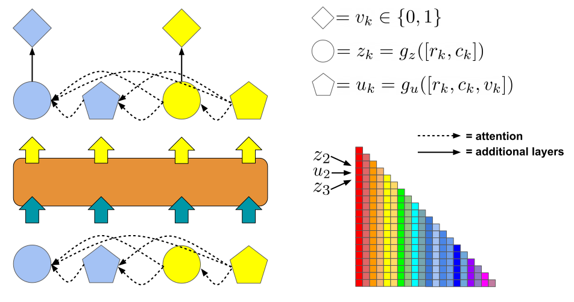
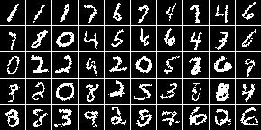
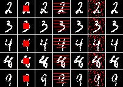

# The DEformer

This is the repository for the paper:

>[Michael A. Alcorn](https://sites.google.com/view/michaelaalcorn) and [Anh Nguyen](http://anhnguyen.me). [The DEformer: An Order-Agnostic Distribution Estimating Transformer](https://arxiv.org/abs/2106.06989). ICML Workshop on Invertible Neural Networks, Normalizing Flows, and Explicit Likelihood Models (INNF+). 2021.

|  |
|:--|
| By including each feature's identity *alongside* its value in the input, sequential models can be used to perform order-agnostic autoregressive distribution estimation. Our DEformer uses an interleaved input design (as partially depicted here with the self-attention mask) for this task. The two sets of interleaved feature vectors consist of pixel identity feature vectors (*z<sub>k</sub>*) and pixel identity/value feature vectors (*u<sub>k</sub>*). *r<sub>k</sub>* and *c<sub>k</sub>* are the row and column for the pixel indexed by *k* in the permuted sequence, respectively, *v<sub>k</sub>* is the value of the pixel (which is zero or one for binary images), and *g<sub>z</sub>* and *g<sub>u</sub>* are multilayer perceptrons. |

|  |
|:--|
| Samples generated by the DEformer. Each sample was generated using a random pixel order. |

|  |
|:--|
| Because the DEformer is order-agnostic, it can easily "fill in" images where pixels are missing in a variety of patterns by placing the missing pixels at the end of the input sequence. Here, each row corresponds to a different ground truth image from the test set (depicted in the first column). The remaining pairs of columns show 100 removed pixels (red) from the ground truth image and the corresponding filled in image. |

## Citation

If you use this code for your own research, please cite:

```
@article{alcorn2021deformer,
   title={The DEformer: An Order-Agnostic Distribution Estimating Transformer},
   author={Alcorn, Michael A. and Nguyen, Anh},
   journal={ICML Workshop on Invertible Neural Networks, Normalizing Flows, and Explicit Likelihood Models (INNF+)},
   year={2021}
}
```

## Training the DEformer

### Setting up `.deformer_profile`

After you've cloned the repository to your desired location, create a file called `.deformer_profile` in your home directory:

```bash
nano ~/.deformer_profile
```

and copy and paste in the contents of [`.deformer_profile`](.deformer_profile), replacing each of the variable values with paths relevant to your environment.
Next, add the following line to the end of your `~/.bashrc`:

```bash
source ~/.deformer_profile
```

and either log out and log back in again or run:

```bash
source ~/.bashrc
```

You should now be able to copy and paste all of the commands in the various instructions sections.
For example:

```bash
echo ${DEFORMER_PROJECT_DIR}
```

should print the path you set for `DEFORMER_PROJECT_DIR` in `.deformer_profile`.

### Running the binarized-MNIST training script

Run (or copy and paste) the following script, editing the variables as appropriate.

```bash
#!/usr/bin/env bash

JOB=$(date +%Y%m%d%H%M%S)

echo "train:" >> ${JOB}.yaml
echo "  dataset: mnist" >> ${JOB}.yaml  # "mnist" or "cifar10".
echo "  train_prop: 0.98" >> ${JOB}.yaml
echo "  workers: 10" >> ${JOB}.yaml
echo "  learning_rate: 1.0e-5" >> ${JOB}.yaml
echo "  patience: 5" >> ${JOB}.yaml

echo "model:" >> ${JOB}.yaml
echo "  mlp_layers: [128, 256, 512]" >> ${JOB}.yaml
echo "  nhead: 8" >> ${JOB}.yaml
echo "  dim_feedforward: 2048" >> ${JOB}.yaml
echo "  num_layers: 6" >> ${JOB}.yaml
echo "  dropout: 0.0" >> ${JOB}.yaml

# Save experiment settings.
mkdir -p ${DEFORMER_EXPERIMENTS_DIR}/${JOB}
mv ${JOB}.yaml ${DEFORMER_EXPERIMENTS_DIR}/${JOB}/

gpu=0
cd ${DEFORMER_PROJECT_DIR}
nohup python3 train_deformer.py ${JOB} ${gpu} > ${DEFORMER_EXPERIMENTS_DIR}/${JOB}/train.log &
```

### Running the POWER training script

Run (or copy and paste) the following script, editing the variables as appropriate.

```bash
#!/usr/bin/env bash

JOB=$(date +%Y%m%d%H%M%S)

echo "train:" >> ${JOB}.yaml
echo "  dataset: power" >> ${JOB}.yaml  # "gas" or "power".
echo "  batch_size: 128" >> ${JOB}.yaml
echo "  workers: 10" >> ${JOB}.yaml
echo "  learning_rate: 1.0e-5" >> ${JOB}.yaml
echo "  patience: 20" >> ${JOB}.yaml

echo "model:" >> ${JOB}.yaml
echo "  idx_embed_dim: 20" >> ${JOB}.yaml
echo "  mix_comps: 150" >> ${JOB}.yaml
echo "  mlp_layers: [128, 256, 512]" >> ${JOB}.yaml
echo "  nhead: 8" >> ${JOB}.yaml
echo "  dim_feedforward: 2048" >> ${JOB}.yaml
echo "  num_layers: 6" >> ${JOB}.yaml
echo "  dropout: 0.2" >> ${JOB}.yaml

# Save experiment settings.
mkdir -p ${DEFORMER_EXPERIMENTS_DIR}/${JOB}
mv ${JOB}.yaml ${DEFORMER_EXPERIMENTS_DIR}/${JOB}/

gpu=0
cd ${DEFORMER_PROJECT_DIR}
nohup python3 train_deformer_tabular.py ${JOB} ${gpu} > ${DEFORMER_EXPERIMENTS_DIR}/${JOB}/train.log &
```

### Running the POWER ARDM training script

Run (or copy and paste) the following script, editing the variables as appropriate.
This script trains an order-agnostic DEformer similar to the order-agnostic Transformer described in Appendix D of "[Autoregressive Diffusion Models](https://arxiv.org/abs/2110.02037)".
The only difference between this model and the original DEformer is that each input in the sequence consists of the concatenation of the column embedding for the value being predicted with the position embedding and value for the previous column in the shuffled sequence, i.e., the length of the input sequence is no longer double the number of columns.
This model achieves a negative log-likelihood of -0.62 (compared to -0.68 for the original DEformer).

```bash
#!/usr/bin/env bash

JOB=$(date +%Y%m%d%H%M%S)

echo "train:" >> ${JOB}.yaml
echo "  dataset: power" >> ${JOB}.yaml  # "gas" or "power".
echo "  batch_size: 128" >> ${JOB}.yaml
echo "  workers: 10" >> ${JOB}.yaml
echo "  learning_rate: 1.0e-5" >> ${JOB}.yaml
echo "  patience: 20" >> ${JOB}.yaml

echo "model:" >> ${JOB}.yaml
echo "  idx_embed_dim: 20" >> ${JOB}.yaml
echo "  mix_comps: 150" >> ${JOB}.yaml
echo "  mlp_layers: [128, 256, 512]" >> ${JOB}.yaml
echo "  nhead: 8" >> ${JOB}.yaml
echo "  dim_feedforward: 2048" >> ${JOB}.yaml
echo "  num_layers: 6" >> ${JOB}.yaml
echo "  dropout: 0.2" >> ${JOB}.yaml

# Save experiment settings.
mkdir -p ${DEFORMER_EXPERIMENTS_DIR}/${JOB}
mv ${JOB}.yaml ${DEFORMER_EXPERIMENTS_DIR}/${JOB}/

gpu=0
cd ${DEFORMER_PROJECT_DIR}
nohup python3 train_deformer_tabular_ardm.py ${JOB} ${gpu} > ${DEFORMER_EXPERIMENTS_DIR}/${JOB}/train.log &
```
